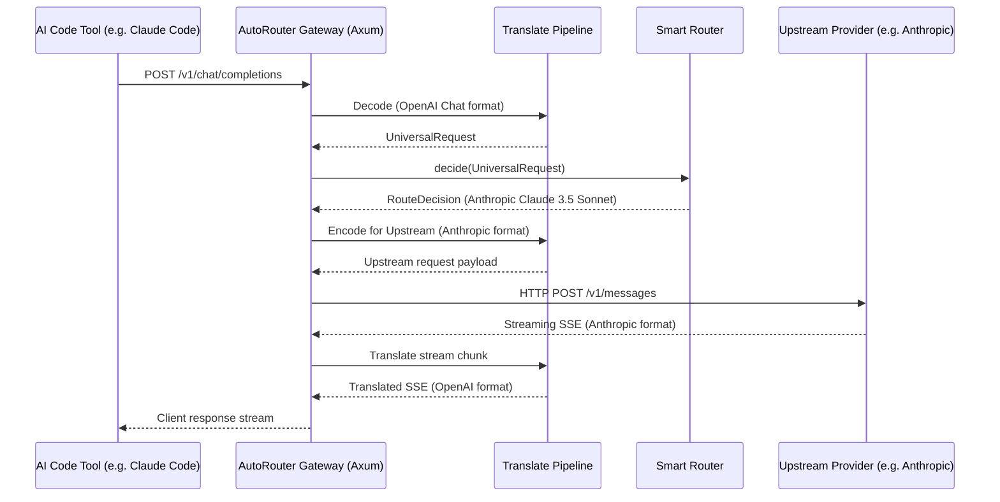
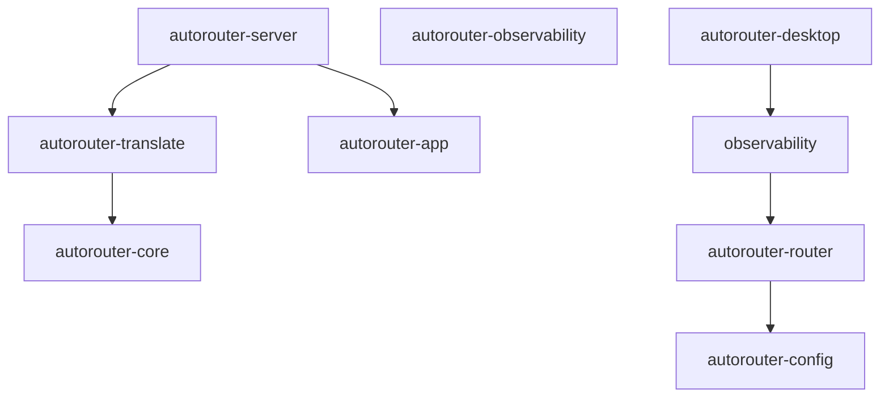

# ⚡ AutoRouter

<p align="center">
  
</p>

<p align="center">
  <b>One local gateway. Every AI protocol. Every model. Every coding tool.</b>
</p>

<p align="center">
  <a href="../../actions/workflows/build.yml"></a>
  <a href="LICENSE"></a>
  <a href="Cargo.toml"></a>
  <a href="crates/autorouter-desktop"></a>
  
</p>

---

AutoRouter is a **local-first desktop application** (Rust + Tauri 2 + React) that emulates the OpenAI, Anthropic, and Gemini wire formats on a single local endpoint (`http://127.0.0.1:4073`) and forwards requests through a smart routing engine to upstream providers.

Configure your AI providers **once** and immediately use any model from any provider inside any supported AI coding tool (such as Claude Code, Codex, Gemini CLI, Continue, Aider, Cline, OpenCode, Warp, Roo Code, and Cursor) — without editing configuration files again.

---

## 🚀 Key Features

* 🔌 **Universal AI Protocol translation**: Drop-in compatibility for OpenAI Chat Completions, OpenAI Responses, Anthropic Messages, and Gemini `generateContent`.
* 🔁 **Agentic tool-call relay**: When bridging Codex's Responses API to a chat-style upstream, the gateway canonicalizes tool names (`shell`→`exec_command`), pairs each `function_call_output` with its originating call, and guards against runaway command loops — so multi-step agentic runs keep working without infinite retries.
* 🧠 **Smart Routing Engine**: Cost minimization, capability checking (e.g. vision/tools), failovers, quota management, and latency scoring.
* 🛡️ **Local-First & Secure**: Loopback by default (`127.0.0.1:4073`). Credentials are kept inside your secure OS Keychain (Windows Credential Manager, macOS Keychain, Linux Secret Service).
* ⚡ **Ultra-low latency**: Zero-copy translations, compiled in Rust, streaming first-byte overhead < 20 ms.
* 📊 **Deep Observability**: Real-time request/trace inspectors, Prometheus metrics (`/metrics`), Criterion benchmarks, and live tail logs.
* 🎛️ **Hot Reload & Restart-Free rebinds**: Seamlessly change settings or bind addresses without losing state or restarting the app.

---

## 🤝 Why Contribute?

AutoRouter sits at the intersection of **modern Rust desktop development (Tauri 2)**, **local-first systems programming (Tokio + Axum)**, and the **rapidly-evolving AI agent ecosystem**. It solves a real-world friction point for developers who want to route their workflows across multiple models/providers efficiently.

### 🌟 Good First Issues & Areas to Extend
We welcome and support contributions of all levels. Here are great places to start:
* **🔌 New Wire-Format Adapters**: Add support for new or emerging provider APIs (e.g., DeepSeek, Grok, Cohere, local Ollama formats) in [autorouter-translate](crates/autorouter-translate).
* **🧠 Smart Routing Strategies**: Design and build rule criteria (cost optimization, auto-fallback schemas, context window routing) in [autorouter-router](crates/autorouter-router).
* **🎨 Dashboard Widgets**: Enhance the React frontend with interactive graphs, token usage history charts, or custom metric filters in [ui/](ui).
* **📝 Developer Tool Recipes**: Test and add configuration guides/recipes for new IDE coding tools and plugins in [manual.md](manual.md).

---

## 🏗️ Architecture & Request Lifecycle

Every request goes through `decode → Universal Schema → decide → encode`. We never do pairwise protocol conversion (e.g. OpenAI to Anthropic directly). The Universal Schema is the single source of truth.



### 📦 Crate Map & Boundaries
The workspace is strictly modularized with clean, acyclic boundaries.



| Crate | Responsibility | Must NOT Touch |
| :--- | :--- | :--- |
| **`autorouter-core`** | Provider-neutral Universal Schema (`Message`, `ContentBlock`, `Tool`, `Usage`, `StreamChunk`). | Wire-format JSON, HTTP, secrets, persistence. |
| **`autorouter-translate`** | Wire-format adapters + translation pipeline + reasoning extraction. | HTTP clients, secrets, storage. |
| **`autorouter-config`** | TOML configuration loader, secret store integration, SQLite storage. | Wire-formats, routing decisions. |
| **`autorouter-router`** | `SmartRouter`, rule engine, capability registry, `HealthTracker`. | HTTP, wire-formats. |
| **`autorouter-server`** | Axum gateway, route registration, bearer auth middleware, `GatewaySupervisor`. | Translation logic, secret store internals. |
| **`autorouter-observability`**| Structured logging (`tracing`), Prometheus metrics, benchmarks. | Translation logic. |
| **`autorouter-app`** | Headless binary entry point (command-line daemon). | UI, Tauri. |
| **`autorouter-desktop`** | Tauri 2 desktop shell, system tray, window controller. | UI styling. |

---

## 🛠️ Contributor Setup & Build Guide

### 📋 Prerequisites
Make sure you have these installed and configured on your path:
* **Rust**: `1.83+` (pinned via `rust-toolchain.toml`)
* **Node.js**: `18 LTS` or later
* **NSIS / WiX Toolset**: (Required for Windows installer builds; auto-downloaded by Tauri CLI if missing)

### 🚀 Running locally in Development

1. **Install scripts & UI dependencies**:
   ```bash
   npm install --prefix scripts
   npm install --prefix ui
   ```
2. **Launch the Desktop Application with hot-reloading**:
   ```bash
   cargo run -p autorouter-desktop
   ```
3. **Alternatively, run the headless command-line daemon (no GUI)**:
   ```bash
   cargo run -p autorouter-app
   ```
4. **Run the UI-only hot reload server**:
   ```bash
   npm run dev --prefix ui
   ```

### 🧪 Running Tests & Benchmarks

Run unit and integration tests across the workspace:
```bash
cargo test --workspace
```

Run latency and translation benchmarks via Criterion:
```bash
cargo bench -p autorouter-observability
```

### 📦 Building Release Installers

The authoritative build script is `scripts/bundle.mjs`. Use it to compile the production desktop application and package installers:

```bash
# Skip code-signing (perfect for local release packaging)
# Windows (PowerShell)
$env:AUTOROUTER_SKIP_SIGNING="1"; node scripts/bundle.mjs

# macOS/Linux (Bash)
AUTOROUTER_SKIP_SIGNING=1 node scripts/bundle.mjs
```

Installers will be generated under `target/release/bundle/`.

---

## 📍 Project Roadmap

* **M0 — Core Foundation**: Universal Schema + 4 wire adapters (OpenAI, Anthropic, Gemini) `[Shipped]`
* **M1 — Upstreams & Security**: HTTP Upstreams + secure OS keychain credential resolver `[Shipped]`
* **M2 — Smart Router**: Rule evaluation, capability filters, failover chains, health tracker `[Shipped]`
* **M3 — Observability**: Structured logs, Request inspector, Prometheus `/metrics` `[Shipped]`
* **M4 — Dashboard UI**: Complete 14-page React-based management interface `[Shipped]`
* **M5 — Robustness & Stream Hardening**: Streaming sentinels, reasoning extractor `<think>` buffers `[Shipped]`
* **M6 — Custom Extension Plugins**: Allow runtime JS plugins for routing and custom formats `[Planned]`
* **M7 — Advanced Cost Analytics**: Interactive graphs mapping tokens/cost over time `[Planned]`

---

## 📖 Learn More

* 📘 [User Manual](manual.md) — Detailed installation, IDE integration recipes, troubleshooting.
* 📐 [Architecture Documentation](docs/architecture.md) — Deeper dive into request lifecycle and data flow.
* 🤖 [Agent Guidelines](AGENTS.md) — Pinned rules and crate boundaries for AI coding assistants working on this repo.
* 📄 [License](LICENSE) — MIT OR Apache-2.0.
